<html lang="en">
<head>
    <meta charset="UTF-8">
    <meta name="viewport" content="width=device-width, initial-scale=1.0">
<style>
    #wrapper
    {
    position:relative;
    text-align:center;
    margin:0 auto;
    padding:0px;
    width:995px;
    z-index:2;
    color: white;
    }
    h1
    {
    margin-top:50px;
    color:white;
    font-size:40px;
    }
    h2
    {
    margin-top:25px;
    color:white;
    font-size:25px;
    }
    p
    {
    margin-top:10px;
    color:white;
    font-size:15px;
    background: rgba(0,0,0,0.2);
    }
</style>
    
</head>
    
<body onload="checking();"> 
<div id="video_wrapper">
  <video autoplay loop>
    <source src="https://drive.google.com/uc?export=view&id=17ygkkkTDZb219cgsmglfod33qP8PGW58" type="video/mp4">
  </video>
</div>
<div id="wrapper">

    
# Screenshot

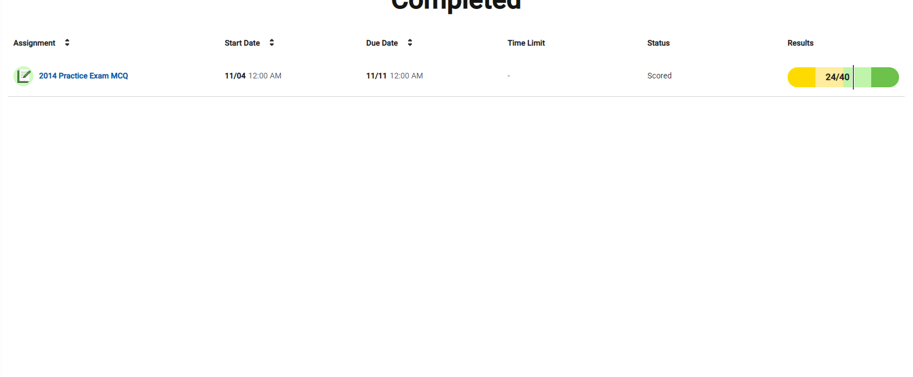

### Q1
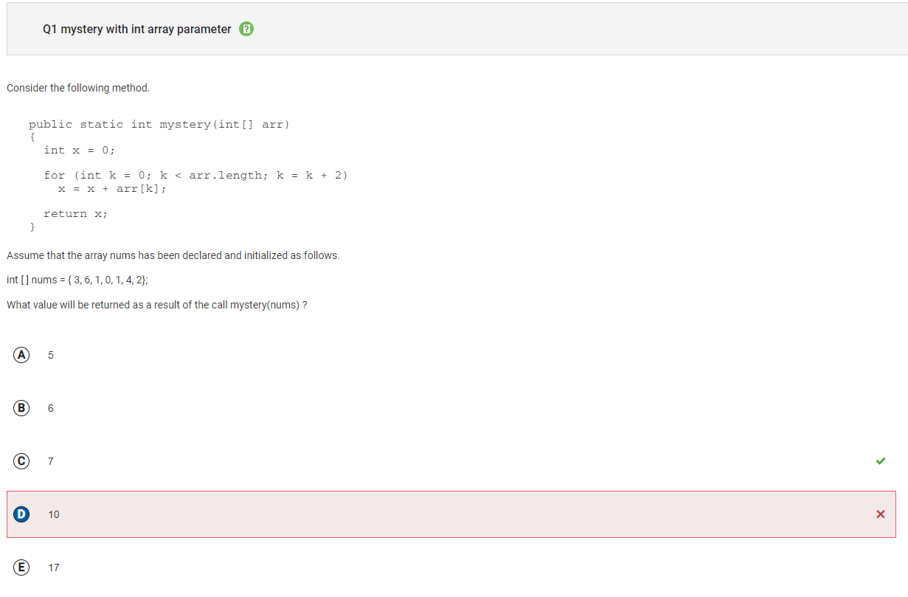

```
Answer D
Incorrect. This would be the result if k was initialized to 1 instead of 0.
```

### Q4
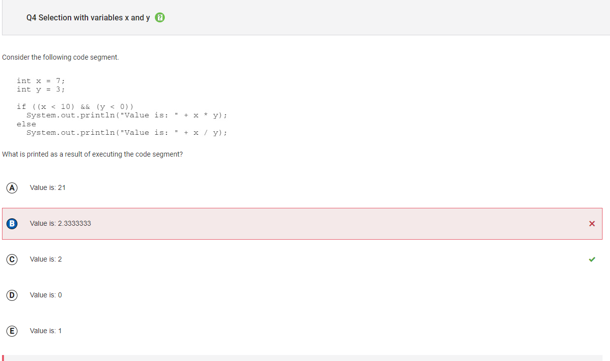

```
Answer B
Incorrect. This would be the result if the division used was floating point division, instead of integer division. This would be the case if either x or y were of type double instead of type int or if either value was typecast as a double in the expression.
```

### Q8
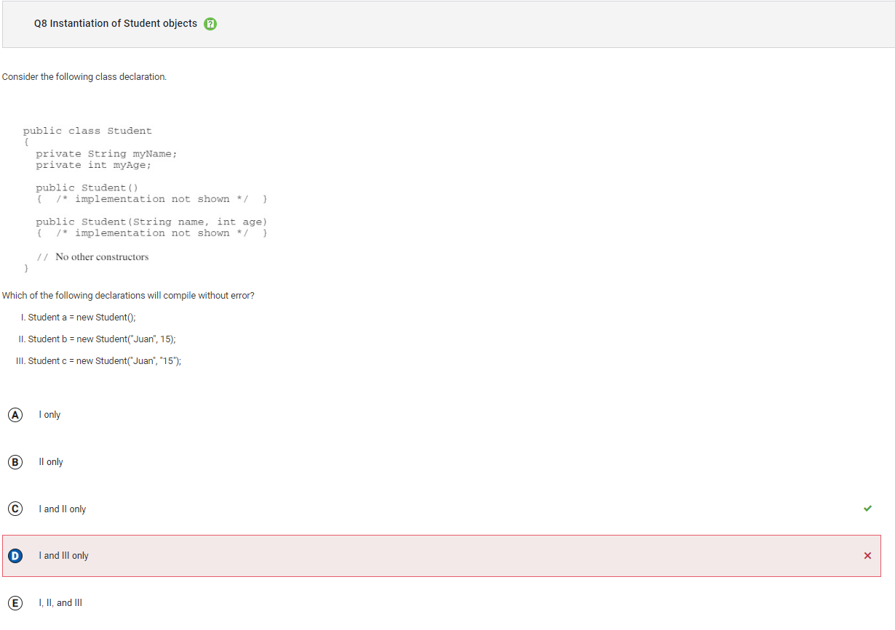
        
```
Answer D
Incorrect. Choice II will also compile as it uses the two-parameter constructor, with the parameters in the order of String then int, to create a new Student object and assign it to variable b of type Student. Choice III attempts to use the two-parameter constructor, however the order of the parameters is a String followed by a String (since both parameters are in quotations). There is no two-parameter constructor with two String parameters. This statement will cause a compile time error.
```

### Q10
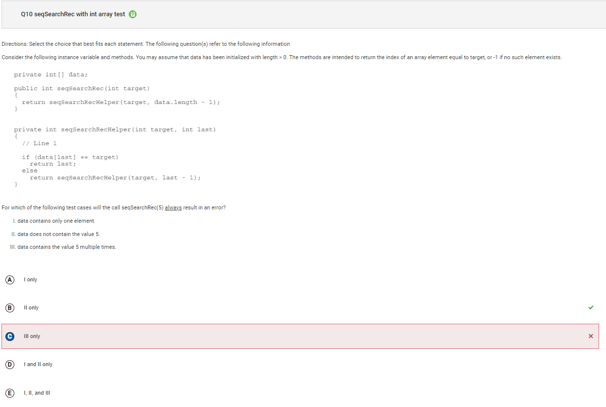

```
Answer C
Incorrect. Choice II will eventually cause an ArrayIndexOutOfBoundsException to be thrown when the recursive call is made with target and -1. This will happen after every valid index in data has been examined. During this call, data[-1] is out of bounds. Choice III will correctly return the index of the element closest to the end of the array with the value target, since data[last] == target will be true at some valid index value of last.
```

### Q12
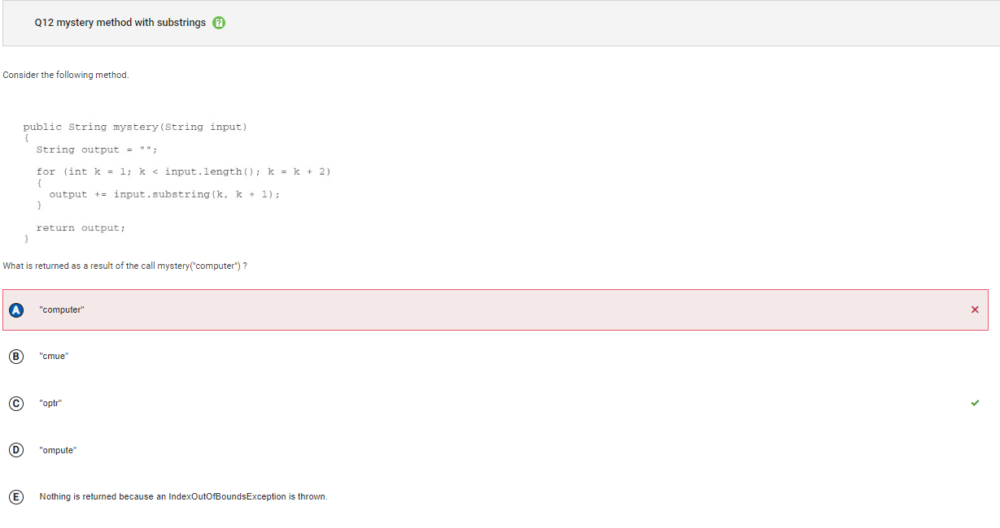

```
Answer A
Incorrect. This would be the return value if k started at 0 and was incremented by 1.
```

### Q14
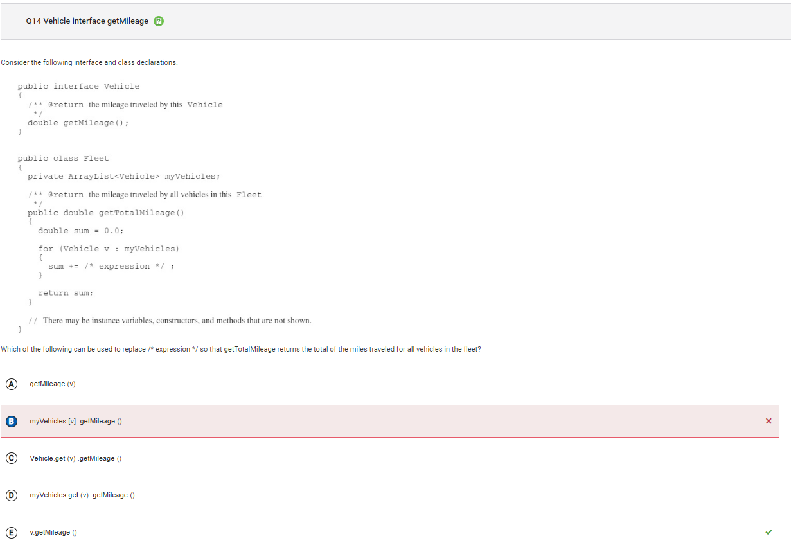

```
Answer B
Incorrect. The access being used here is what would be used if myVehicles was an array instead of an ArrayList and v was an index of the myVehicles array. However, in this case an enhanced for loop is being used, which accesses the elements of myVehicles directly and assigns v the value of the elements. Please note that interface is no longer a part of the AP CSA exam.
```

### Q15
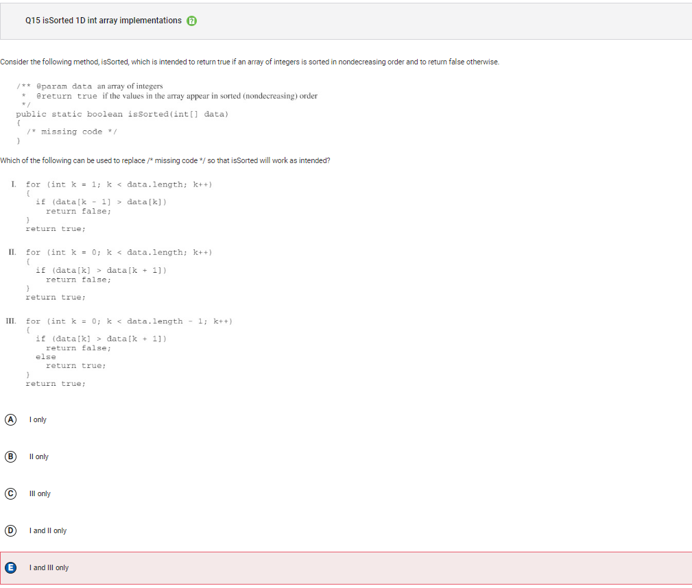

```
Answer E
Incorrect. Choice III has a loop control variable k that starts at 0, increments by 1, and will terminate the loop when k has the value data.length – 1. In each iteration, there is a check to see if the current value is larger than the subsequent value. If it is, false is returned because elements would not be nondecreasing, otherwise true is returned. As a result, only data[0] and data[1] are examined. The remaining elements in data are not checked because the method will stop once a return statement is reached. This means that the method could return true even when there are consecutive elements in data that are nondecreasing.
```

### Q16
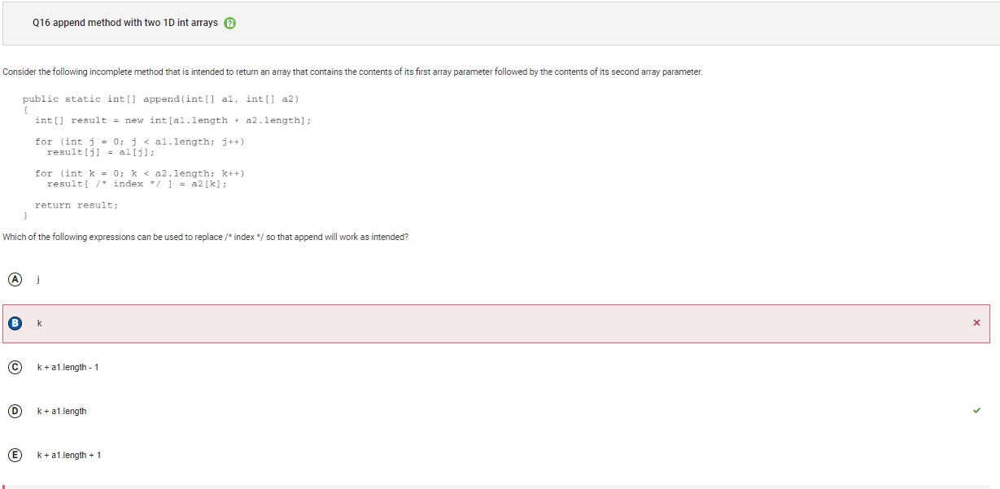

```
Answer B
Incorrect. Using the value of k will mean that some or all of the elements from a1 will not be in result as they will be replaced with a2 values. In the first for loop, result[0] was assigned a1[0]. In the second loop, when k has the value 0, result[0] will be assigned a2[0].
```

### Q19
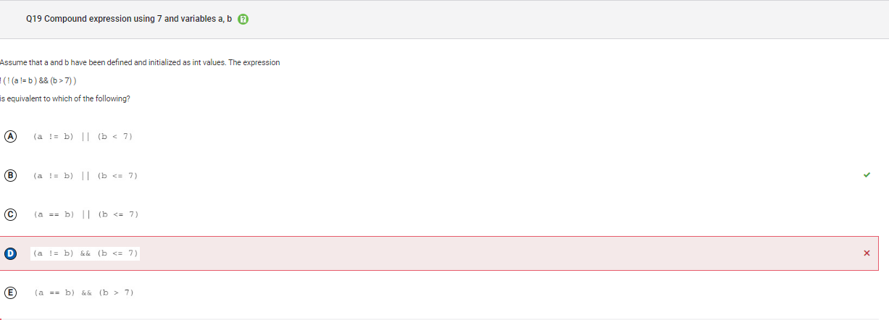

```
Answer D
Incorrect. When you apply De Morgan’s Law the logic operator and (&&) becomes an or (||) and vice versa.
```

### Q20
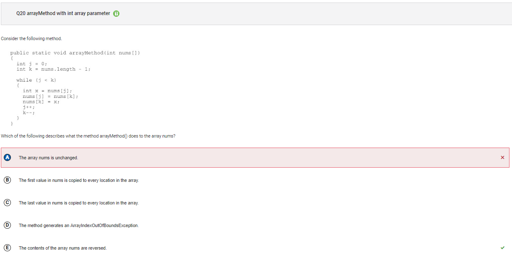

```
Answer A
Incorrect. Since the while loop terminates when j is greater than or equal to k, the first half of the elements in nums are swapped with the second half of the elements in nums. If the while condition was changed to j < nums.length, then all the elements would be swapped and then swapped back to their original location and nums would be unchanged.
```

### Q23
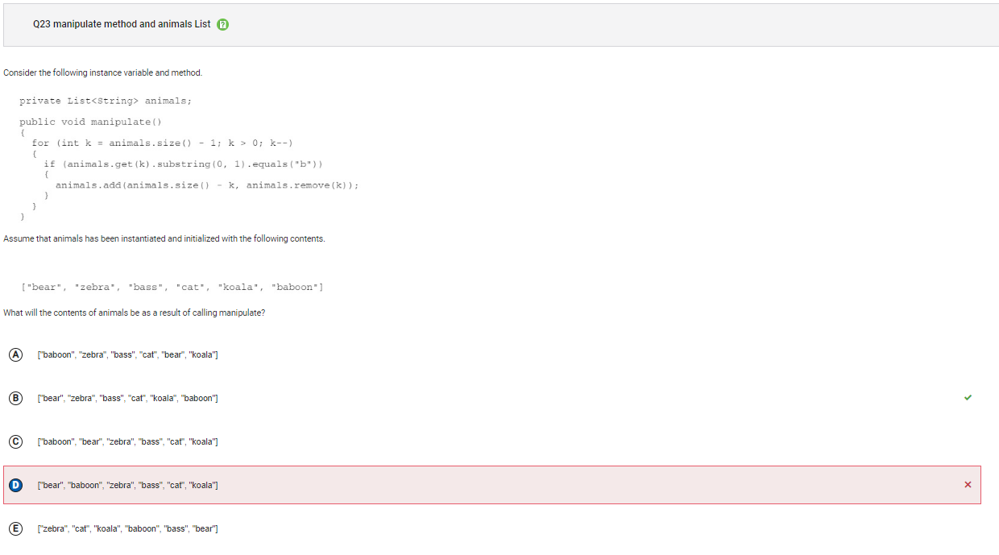

```
Answer D
Incorrect. List is an interface, which an ArrayList implements. Please note that List is no longer tested as part of the AP CSA exam and ArrayList will be used instead. This would be the case if the loop condition was k > 1 rather than k > 0.
```

### Q25
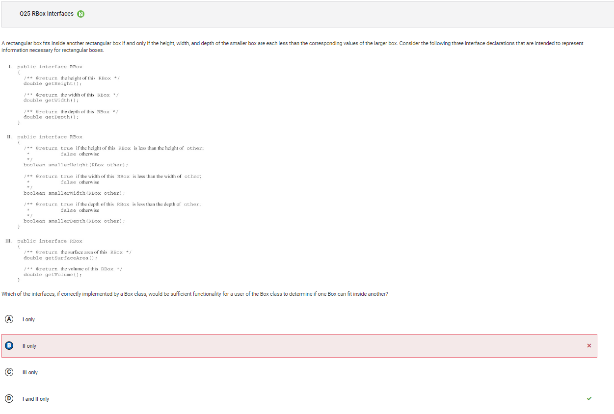

```
Answer B
Incorrect. Please note that interface is no longer a part of the AP CSA exam. Choice I provides the user access to the height, width, and depth of a box through the accessor methods getHeight, getWidth, and getDepth. This allows comparisons to be made in each of the three dimensions to determine if one box can fit inside another box.
```

### Q28
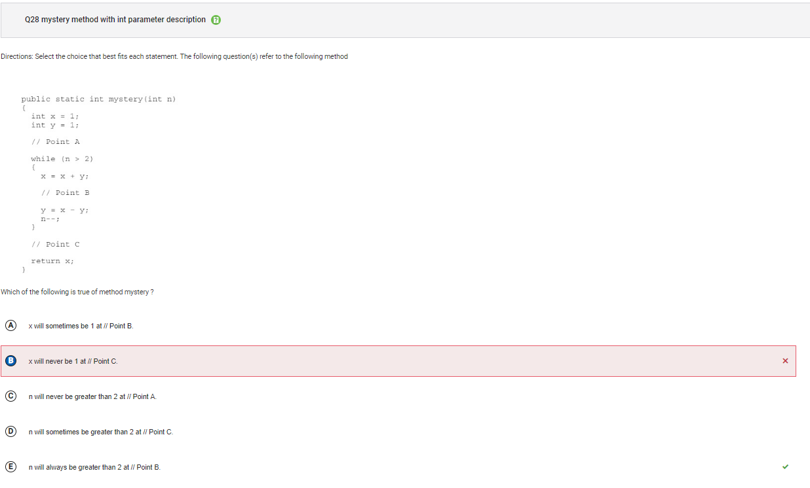

```
Answer B
Incorrect. If the value of n is 2 or less in the original call to the method mystery, the loop will be skipped and x will be 1 at //Point C.
```

### Q30
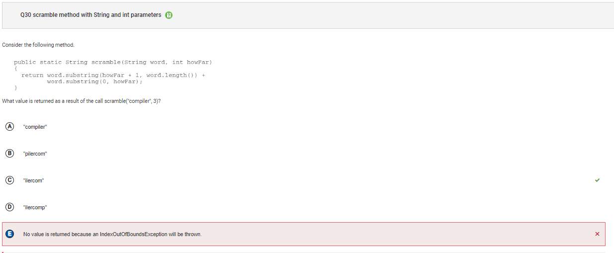

```
Answer E
Incorrect. Since the two parameter substring method returns the substring beginning at the first parameter and ending at the second parameter – 1, no IndexOutOfBoundsException will be thrown. The indices 4, 7 (in the first call to substring), 0 and 2 (in the second call to substring) are all valid indices in "compiler".
```

### Q34
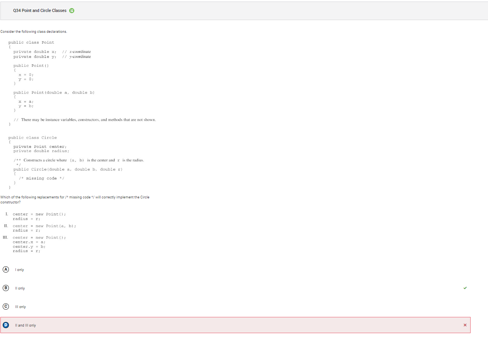

```
Answer D
Incorrect. Choice III uses the default Point constructor to assign center a new Point with x and y both equal to 0. It attempts to update x and y, however since they are private instance variables in Point, they are not able to be accessed directly in Circle. This code will cause a compile time error.
```

### Q39
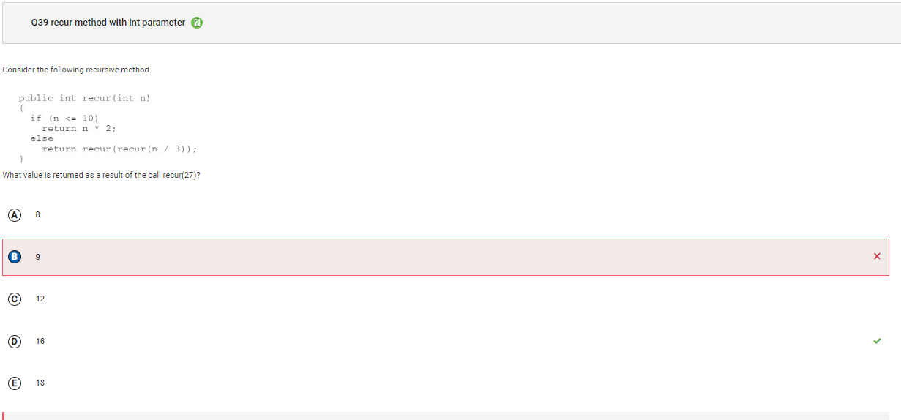

```
Answer B
Incorrect. This is the value that is passed in the first recursive call to recur.
```


</div>
    <script src="{{ '/assets/js/videojava.js' | relative_url }}" type="text/javascript"></script>
</body>
