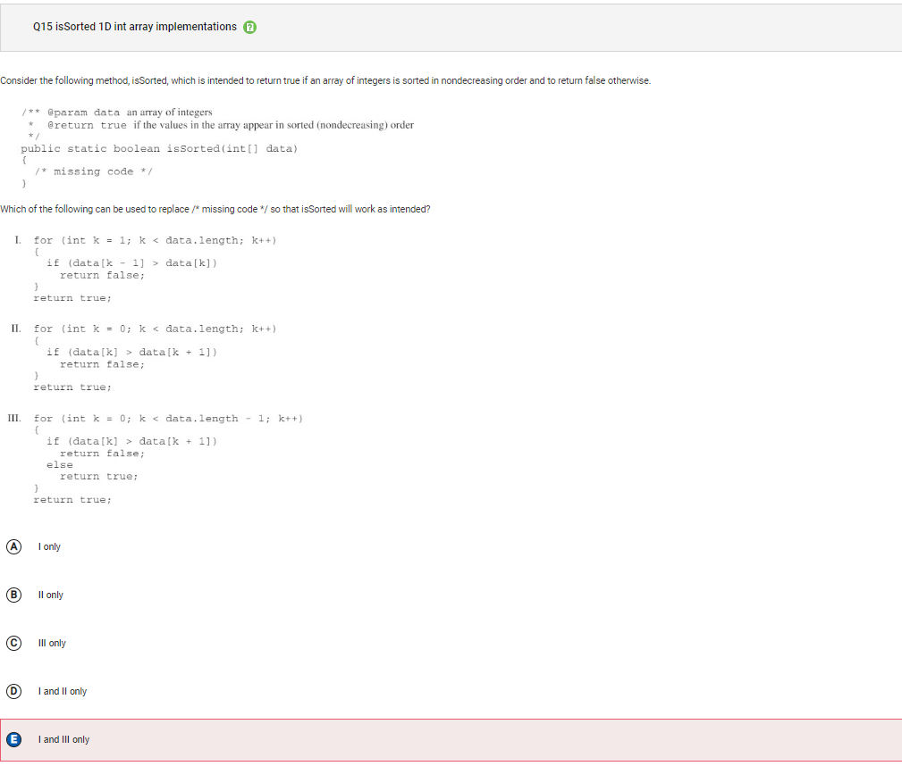
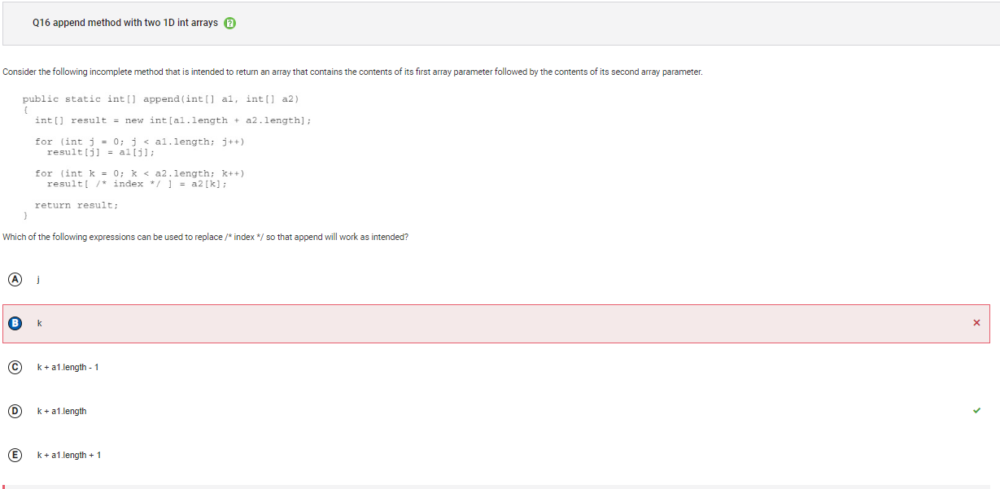
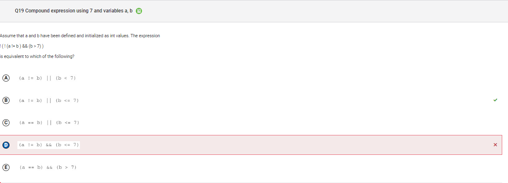
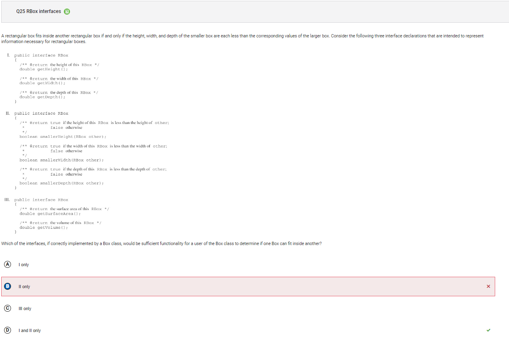
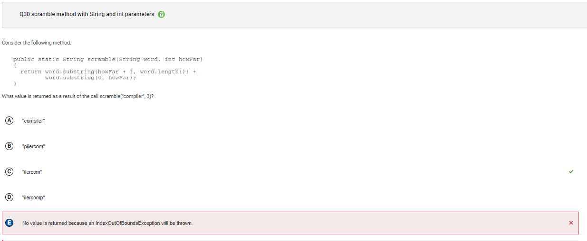
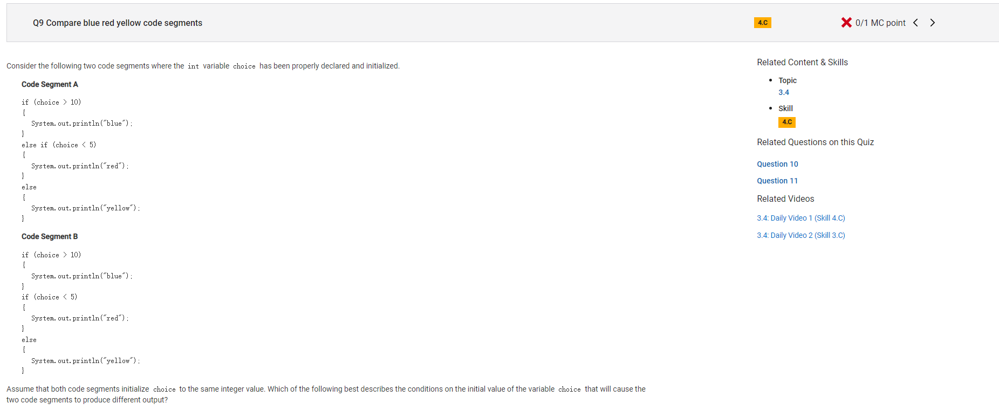
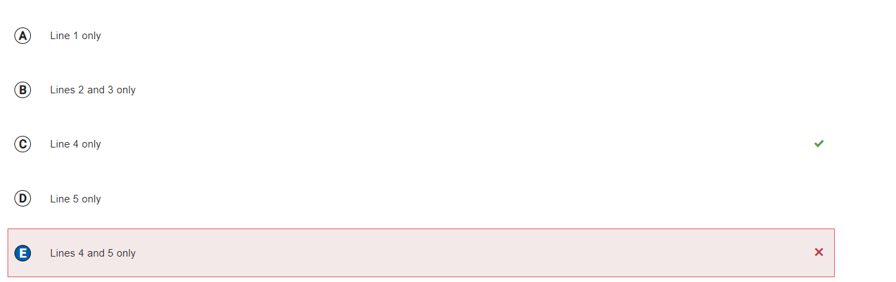

<html lang="en">
<head>
    <meta charset="UTF-8">
    <meta name="viewport" content="width=device-width, initial-scale=1.0">
    
    <style>
    #wrapper
    {
    position:relative;
    text-align:center;
    margin:0 auto;
    padding:0px;
    width:995px;
    z-index:2;
    color: white;
    }
    h1
    {
    margin-top:50px;
    color:white;
    font-size:40px;
    }
    h2
    {
    margin-top:25px;
    color:white;
    font-size:25px;
    }
    p
    {
    margin-top:10px;
    color:white;
    font-size:15px;
    background: rgba(0,0,0,0.2);
    }
</style>
</head>
    
<body onload="checking();"> 
<div id="video_wrapper">
  <video autoplay loop id="background">
    <source src="https://drive.google.com/uc?export=view&id=17ygkkkTDZb219cgsmglfod33qP8PGW58" type="video/mp4">
  </video>
</div>

    
<div id="wrapper">    
<h1>MCQ2014</h1>


<h2>Q1</h2>


```
Answer D
Incorrect. This would be the result if k was initialized to 1 instead of 0.
```

<h2>Q4</h2>


```
Answer B
Incorrect. This would be the result if the division used was floating point division, instead of integer division. This would be the case if either x or y were of type double instead of type int or if either value was typecast as a double in the expression.
```

<h2>Q8</h2>

        
```
Answer D
Incorrect. Choice II will also compile as it uses the two-parameter constructor, with the parameters in the order of String then int, to create a new Student object and assign it to variable b of type Student. Choice III attempts to use the two-parameter constructor, however the order of the parameters is a String followed by a String (since both parameters are in quotations). There is no two-parameter constructor with two String parameters. This statement will cause a compile time error.
```

<h2>Q10</h2>


```
Answer C
Incorrect. Choice II will eventually cause an ArrayIndexOutOfBoundsException to be thrown when the recursive call is made with target and -1. This will happen after every valid index in data has been examined. During this call, data[-1] is out of bounds. Choice III will correctly return the index of the element closest to the end of the array with the value target, since data[last] == target will be true at some valid index value of last.
```

<h2>Q12</h2>


```
Answer A
Incorrect. This would be the return value if k started at 0 and was incremented by 1.
```

<h2>Q14</h2>


```
Answer B
Incorrect. The access being used here is what would be used if myVehicles was an array instead of an ArrayList and v was an index of the myVehicles array. However, in this case an enhanced for loop is being used, which accesses the elements of myVehicles directly and assigns v the value of the elements. Please note that interface is no longer a part of the AP CSA exam.
```

<h2>Q15</h2>


```
Answer E
Incorrect. Choice III has a loop control variable k that starts at 0, increments by 1, and will terminate the loop when k has the value data.length – 1. In each iteration, there is a check to see if the current value is larger than the subsequent value. If it is, false is returned because elements would not be nondecreasing, otherwise true is returned. As a result, only data[0] and data[1] are examined. The remaining elements in data are not checked because the method will stop once a return statement is reached. This means that the method could return true even when there are consecutive elements in data that are nondecreasing.
```

<h2>Q16</h2>


```
Answer B
Incorrect. Using the value of k will mean that some or all of the elements from a1 will not be in result as they will be replaced with a2 values. In the first for loop, result[0] was assigned a1[0]. In the second loop, when k has the value 0, result[0] will be assigned a2[0].
```

<h2>Q19</h2>


```
Answer D
Incorrect. When you apply De Morgan’s Law the logic operator and (&&) becomes an or (||) and vice versa.
```

<h2>Q20</h2>


```
Answer A
Incorrect. Since the while loop terminates when j is greater than or equal to k, the first half of the elements in nums are swapped with the second half of the elements in nums. If the while condition was changed to j < nums.length, then all the elements would be swapped and then swapped back to their original location and nums would be unchanged.
```

<h2>Q23</h2>


```
Answer D
Incorrect. List is an interface, which an ArrayList implements. Please note that List is no longer tested as part of the AP CSA exam and ArrayList will be used instead. This would be the case if the loop condition was k > 1 rather than k > 0.
```

<h2>Q25</h2>


```
Answer B
Incorrect. Please note that interface is no longer a part of the AP CSA exam. Choice I provides the user access to the height, width, and depth of a box through the accessor methods getHeight, getWidth, and getDepth. This allows comparisons to be made in each of the three dimensions to determine if one box can fit inside another box.
```

<h2>Q28</h2>


```
Answer B
Incorrect. If the value of n is 2 or less in the original call to the method mystery, the loop will be skipped and x will be 1 at //Point C.
```

<h2>Q30</h2>


```
Answer E
Incorrect. Since the two parameter substring method returns the substring beginning at the first parameter and ending at the second parameter – 1, no IndexOutOfBoundsException will be thrown. The indices 4, 7 (in the first call to substring), 0 and 2 (in the second call to substring) are all valid indices in "compiler".
```

<h2>Q34</h2>


```
Answer D
Incorrect. Choice III uses the default Point constructor to assign center a new Point with x and y both equal to 0. It attempts to update x and y, however since they are private instance variables in Point, they are not able to be accessed directly in Circle. This code will cause a compile time error.
```

<h2>Q39</h2>


```
Answer B
Incorrect. This is the value that is passed in the first recursive call to recur.
```

<h1>Collegeboard 66 Qs</h1>

    



    
```
Answer E<br>
Incorrect. When choice is greater than 10, code segment A will print "blue" and the else statements are not executed. Code segment B will print "blue" but will then execute the next if statement and print "yellow", thereby giving different output for initial values that are greater than 10. Therefore, there are some initial values for choice that will cause the two code segments to produce different output.
<br>
Correct Answer: C<br>
Reason: When choice is greater than 10, code segment A will print "blue" and the else statements are not executed. Code segment B will print "blue" but will then execute the next if statement and print "yellow", thereby giving different output for initial values that are greater than 10.
```
    


    
```
Answer A<br>
Incorrect. Line 5 is intended to iterate over all columns of arr and correctly assigns to col all values from 0 to the number of columns in arr, inclusive.
<br>
Correct Answer: C<br>
Reason: Two-dimensional arrays are stored as arrays of one-dimensional arrays. Line 8
 is intended to assign to row, a one-dimensional array of int values, a single row of the two-dimensional array arr. The original version of line 8
 attempts to assign a row of col, but col is not a two-dimensional array.
```
    


    
```
Answer A<br>
Incorrect. This would result from incrementing counter when "a" is followed by "b". This occurs one time.
<br>
Correct Answer: D<br>
Reason: The expression str.substring(i, i + 1).equals("a") will evaluate to true if str contains the string "a" at position i. The expression !str.substring(i + 1, i + 2) will evaluate to true if str does not contain the string "b" at position i + 1. The variable counter is incremented when both of those expressions evaluate to true or, in other words, whenever "a" is not immediately followed by "b". This occurs five times in the given string: "a ", "ac", "at", "at", and "a ".
```
    

    
```
Answer A<br>
Incorrect. The variable b1 has the value false but b2 is assigned the value true since 17 % 3 == 2 evaluates to true.
<br>
Correct Answer: B<br>
Reason: The expression 17 % 3 == 1 evaluates to false, and true && false evaluates to false, so b1 is assigned the value false. The expression on the right-hand side of the assignment statement for b2 evaluates to false by short circuit evaluation.
```
    


    
```
Answer A<br>
Incorrect.
<br>
Correct Answer: D<br>
Reason: Still don't understand.
```
    


    
```
Answer E<br>
Incorrect. 
<br>
Correct Answer: C<br>
Reason: Still don't understand, maybe because line 4 "r" has not been called in the method getDirection
```
    


    
```
Answer D<br>
Incorrect.
<br>
Correct Answer: B<br>
Reason: Still don't understand
```
    


```
Answer C<br>
Incorrect. This change would print "OneTwoThree" on the first line and "Four" on the second line.
<br>
Correct Answer: B<br>
Reason: As is, the code segment prints all four strings on the same line. Changing print to println in line 2 will move the cursor to the next line after "Two" is printed.
```
    


    
```
Answer B<br>
Incorrect. This method call returns false because the first character is lexicographically less than the second character of the string.
<br>
Correct Answer: D<br>
Reason: If the first character of str is lexicographically greater than the second character of str, the method returns the result of the recursive call with a parameter that contains all but the first character of str. If the first character of str is lexicographically less than or equal to the second character of str, the method returns false. If no such character pair (where the first character of str is lexicographically less than or equal to the second character of str) is found, the base case is reached and the value true is returned.
```
    


    
```
Answer D<br>
Incorrect. 
<br>
Correct Answer: E<br>
Reason: that makes sense, only k++ when it doesn't remove the element.
```
    


    
```
Answer E<br>
Incorrect. Choice I will return the correct value if the element in the array with one element was target. In this case, with the first call to seqSearchRecHelper the value of data[0] would be target and 0 would be returned. Choice III will correctly return the index of the element closest to the end of the array with the value target, since data[last] == target will be true at some valid index value of last.
<br>
Correct Answer: B<br>
Reason: Choice I will return the correct value if the element in the array with one element was target. In this case, with the first call to seqSearchRecHelper the value of data[0] would be target and 0 would be returned. Choice II will eventually cause an ArrayIndexOutOfBoundsException to be thrown when the recursive call is made with target and -1. This will happen after every valid index in data has been examined. During this call, data[-1] is out of bounds. Choice III will correctly return the index of the element closest to the end of the array with the value target, since data[last] == target will be true at some valid index value of last.
```
    


    
```
Answer C<br>
Incorrect. A variable of a superclass type can reference an object of the subclass. In this case, TennisPlayer is a subclass of Athlete. A variable of type Athlete can reference an object of type TennisPlayer. Please note that interface is no longer a part of the AP CSA exam.
<br>
Correct Answer: D<br>
Reason: Variables of type Student need to reference objects of types that implement Student. The Athlete class does not implement the Student interface. Please note that interface is no longer a part of the AP CSA exam.
```
    


    
```
Answer E<br>
Incorrect. The code segment is intended to leave arr1 unchanged and store the smaller of two values in minArray. If lines 7–10 are removed, the code segment will store the smaller of each pair of values in arr1.
<br>
Correct Answer: C<br>
Reason: Line 5 modifies an element of arr1 if that element is smaller than the corresponding element of minArray, which is NOT what is intended, since arr1 should remain unchanged.
```
    


</div>
<script src="{{ '/assets/js/videojava.js' | relative_url }}" type="text/javascript"></script>
</body>
