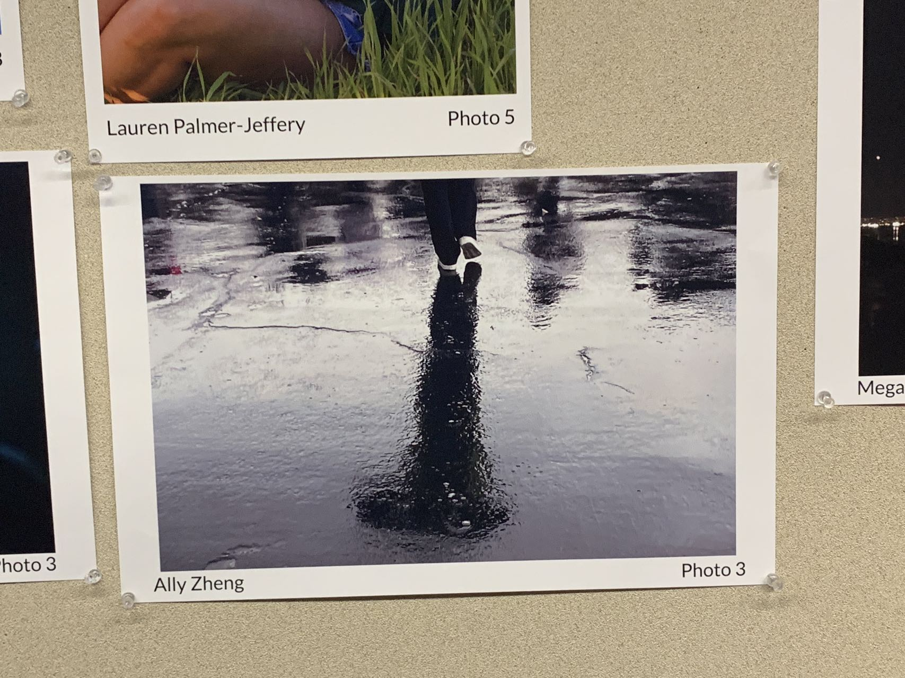

<html lang="en">
<head>
    <meta charset="UTF-8">
    <meta name="viewport" content="width=device-width, initial-scale=1.0">

    
</head>

<body onload="checking(); startTimer();"> 

  <video autoplay loop id="background">
    <source src="https://drive.google.com/uc?export=view&id=17ygkkkTDZb219cgsmglfod33qP8PGW58" type="video/mp4">
  </video>

    

        
         <table>
            <tr>
                <td>

</td>
                <td><a href="https://github.com/aaditgupta21/football-pages/graphs/contributors">See commits for the project tri 1</a></td>
                <td><a href="https://github.com/CanCodeDevelopment/cancode-frontend/commits/main">See commits for the project tri 2</a></td>
            </tr>
        </table>
  <table style="width: 25%; margin-top: 3%; position: absolute;">
      <tr>
        <th>
            <h1>
            Tri 1 Night of Museum capture
            </h1>
            
          </th>
      </tr>
      <tr>
        <th><button type="button" onclick="displayPreviousImage()">Previous</button>
       <button type="button" onclick="displayNextImage()">Next</button></th>
      </tr>
      <tr>
      <th>
      <h1>
      Tri 2 Night of Museum capture
      </h1>
      </th>
      </tr>
      <tr>
        <th><button type="button" onclick="displayPreviousImage2()">Previous</button>
       <button type="button" onclick="displayNextImage2()">Next</button></th>
      </tr>
  </table>

   

    

    
</body>
</html>
